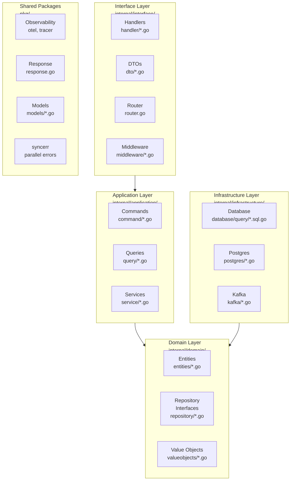
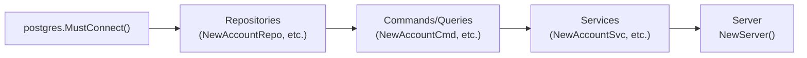

# Architecture — Penster

## Overview

Penster uses **Clean Architecture** with four main layers, plus **CQRS** within the application layer.



## Directory Structure

```
penster/
├── cmd/server/              # Application entry points
│   ├── main.go              # Bootstrap: config, infra, scheduler, server
│   ├── infra.go             # Dependency injection wiring
│   └── server.go            # HTTP server setup on :8080
├── config/                   # Configuration structs (env var mapping)
├── internal/
│   ├── application/
│   │   ├── command/          # Write operations (Create, Update, Delete)
│   │   ├── query/           # Read operations (GetByID, List, Reports)
│   │   └── service/         # Business logic orchestration
│   ├── domain/
│   │   ├── entities/         # Core business objects (Account, Transaction, etc.)
│   │   ├── repository/      # Repository interface definitions
│   │   └── valueobjects/   # Parameter transformation helpers
│   ├── infrastructure/
│   │   ├── database/        # sqlc-generated query layer
│   │   ├── postgres/        # Connection pool, migrator
│   │   └── kafka/           # Kafka producer (configured, not heavily used)
│   ├── interface/
│   │   ├── handler/         # HTTP request handlers
│   │   ├── dto/            # Request/response models
│   │   ├── middleware/      # Logging, Recovery
│   │   └── router/         # Route registration (ServeMux)
│   └── scheduler/
│       ├── engine/         # Ticker-based job dispatch
│       └── jobs/          # RateCurrencyJob
├── migrations/              # SQL up/down migration pairs
├── pkg/
│   ├── models/             # Shared model structs
│   ├── observability/      # OTEL tracer setup, span helpers
│   ├── response/           # Standardized API response
│   └── syncerr/           # Parallel error collection
├── infra/                  # Docker Compose files (local, staging)
└── docs/                  # Documentation
```

## Layer Responsibilities

### Domain Layer (`internal/domain/`)

**Entities** (`entities/`) — pure business objects with no framework dependencies:
- `Account` — holds balance, type, name
- `Category` — classifies transactions
- `Transaction` — confirmed financial movement
- `Draft` — pending transaction awaiting confirm/reject
- `Report` — report error types

**Repository Interfaces** (`repository/`) — define data access contracts:
- `AccountRepository`, `CategoryRepository`, `TransactionRepository`, `DraftRepository`, `ReportRepository`, `RateCurrencyRepository`
- No implementation here — depends on infrastructure layer

**Value Objects** (`valueobjects/`) — parameter transformation helpers:
- `Transaction` — transforms create/update params
- `Draft` — transforms draft params

### Application Layer (`internal/application/`)

**Commands** (`command/`) — write operations:
- `AccountCommand`: Create, Update, Delete, UpdateBalance
- `TransactionCommand`: Create, Update, Delete
- `CategoryCommand`: Create, Update, Delete
- `DraftCommand`: Create, Update, Delete, UpdateStatus
- `RateCurrencyCommand`: Upsert

**Queries** (`query/`) — read operations:
- `AccountQuery`: GetByID, List, GetIDBySubID
- `TransactionQuery`: GetByID, List
- `CategoryQuery`: GetByID, List
- `DraftQuery`: GetByID, List
- `ReportQuery`: Summary, ByAccount, ByCategory, Trends
- `RateCurrencyQuery`: Get

**Services** (`service/`) — orchestrate business logic:
- `AccountService` — manages account balance update/reverse logic
- `TransactionService` — validates entities, handles balance updates, uses `syncerr.Group` for parallel validation
- `CategoryService`
- `DraftService` — handles confirm/reject lifecycle
- `ReportService`
- `RateCurrencyService`

### Interface Layer (`internal/interface/`)

**Handlers** — receive HTTP requests, call services, return responses:
- `account.go`, `category.go`, `transaction.go`, `draft.go`, `report.go`, `health.go`

**DTOs** — request validation and response transformation:
- `account.go`, `category.go`, `transaction.go`, `draft.go`, `report.go`, `dto.go`

**Router** (`router/router.go`) — registers all HTTP routes using `http.ServeMux`:
- Middleware chain: OTEL Tracing → Logging → Recovery

**Middleware** (`middleware/`) — cross-cutting concerns:
- `Logging` — logs incoming requests and response duration
- `Recovery` — catches panics, returns 500

### Infrastructure Layer (`internal/infrastructure/`)

**Database** (`database/`) — sqlc-generated Go from SQL:
- `accounts.sql.go`, `categories.sql.go`, `transactions.sql.go`, `drafts.sql.go`, `rate_currencies.sql.go`

**Postgres** (`postgres/`) — database connectivity:
- `pool.go` — `pgxpool` connection pool
- `migrator.go` — runs SQL migrations via `golang-migrate`

**Kafka** (`kafka/`) — event publishing (configured but not extensively used)

### Scheduler (`internal/scheduler/`)

- `Engine` — ticker-based job scheduler (1-second interval)
- `Job` interface — `Run() error` and `Next() time.Time`
- `RateCurrencyJob` — fetches ECB FX rates on hourly schedule

## Dependency Injection

`cmd/server/infra.go` wires all dependencies:



1. Connect to PostgreSQL
2. Create repositories from sqlc-generated database queries
3. Create command/query objects from repositories
4. Create services from command/query objects
5. Pass services to HTTP server

## CQRS Implementation

Commands and queries are completely separated at the application layer. Services inject both command and query objects and decide which to use based on the operation type.

```
Write (Command) → Service → Repository → DB
Read (Query)    → Service → Repository → DB
```

## Middleware Chain

```
HTTP Request
    ↓
otelhttp.Handler (OpenTelemetry tracing)
    ↓
LoggingMiddleware (logs method, path, duration)
    ↓
RecoveryMiddleware (catches panic, returns 500)
    ↓
Handler
```

## Observability

**OpenTelemetry** spans are created at:
- **HTTP layer** — all requests wrapped by `otelhttp.NewHandler`
- **Service layer** — `observability.StartServiceSpan(ctx, "ServiceName.Method")`
- **Repository layer** — `observability.StartRepoSpan(ctx, "RepoName.Method")`

Traces exported via gRPC OTLP to Jaeger (configurable via `OTEL_EXPORTER_OTLP_ENDPOINT`).

## Key Design Patterns

| Pattern | Where Used | Purpose |
|---|---|---|
| Clean Architecture | Layer separation | Independent, testable layers |
| CQRS | Application layer | Separate read/write concerns |
| Dependency Injection | `infra.go` | Loose coupling via interfaces |
| Soft Deletes | All entities | Audit trail, no data loss |
| "Reverse then Apply" | `AccountService.UpdateBalance` | Race condition prevention |
| `syncerr.Group` | `TransactionService` | Collect all parallel errors |
| Ticker Scheduler | `scheduler/engine` | Simple job scheduling |