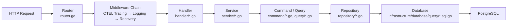
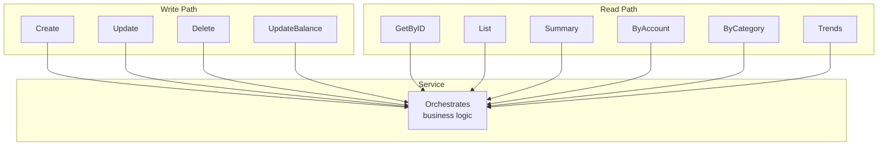
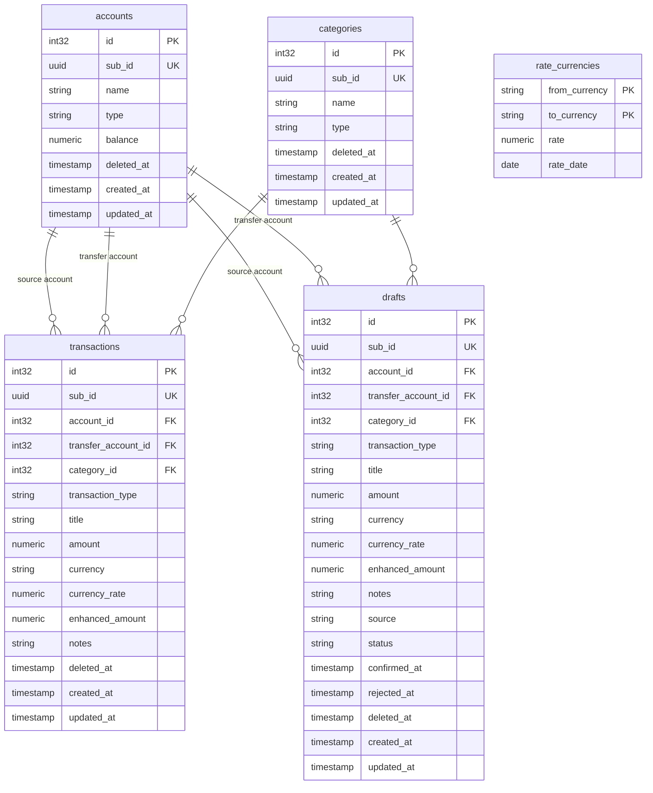
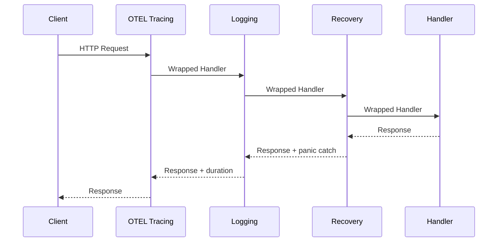
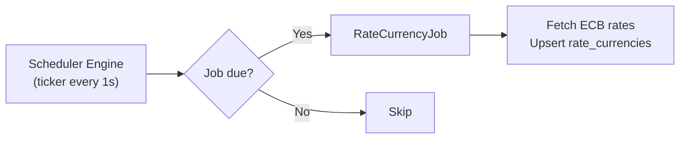

# Engineering Specifications — Penster

## Architecture Overview

Penster follows **Clean Architecture** with **CQRS (Command Query Responsibility Segregation)**.

## Request Flow

## CQRS Pattern

## Database Schema

## Key Design Decisions

### Soft Deletes
All major entities have a `deleted_at` timestamp. Deletes set this field rather than removing rows, preserving audit history.

### Balance Update Pattern
When a transaction affects an account balance, the update follows a **"reverse first, then apply"** pattern:
1. Reverse the previous amount from the account
2. Apply the new amount

This prevents race conditions when multiple transactions update the same account concurrently.

### Parallel Validation with `syncerr.Group`
Service operations that validate multiple entities in parallel use `syncerr.Group` to collect all errors before failing, providing complete feedback rather than failing on the first error.

### UUID Sub-IDs
External-facing IDs use UUID (`sub_id`) for safe URL exposure. Internal joins use auto-increment `int32` for efficiency.

## Middleware Chain

## Scheduler

The scheduler runs on a ticker-based engine (1-second interval). Jobs are dispatched when their next run time is reached.

**Current jobs:**
- `RateCurrencyJob` — fetches ECB FX rates hourly

## Observability

OpenTelemetry spans are created at three layers:
- **HTTP layer** — `otelhttp.NewHandler` wraps all requests
- **Service layer** — `observability.StartServiceSpan()`
- **Repository layer** — `observability.StartRepoSpan()`

Traces are exported via OTLP to Jaeger.

## Layer Responsibilities

| Layer | Responsibility |
|---|---|
| `domain/entities` | Core business objects, no dependencies |
| `domain/repository` | Interface definitions (no implementation) |
| `application/command` | Write operations (Create, Update, Delete) |
| `application/query` | Read operations (GetByID, List, reports) |
| `application/service` | Business logic orchestration |
| `interface/handler` | HTTP request/response handling |
| `interface/dto` | Request validation, response transformation |
| `interface/router` | Route registration |
| `infrastructure/database` | sqlc-generated SQL queries |
| `infrastructure/postgres` | Connection pool, migrations |
| `pkg/observability` | OTEL setup, span helpers |